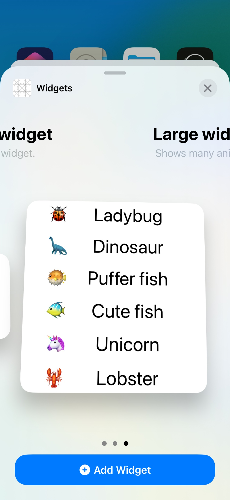

# Widgets

Hands-on the WWDC videos related to iOS widgets.

## [Widgets Code-along, part 1: The adventure begins](https://developer.apple.com/videos/play/wwdc2020/10034/)

A widget is a SwiftUI view that updates over time.

Create a widget target: `File > New > Target > Widget`.

Activate the target.

We can preview widgets using SwiftUI previews.

Add a preview context: `WidgetPreviewContext(family:)`.

`Widget` protocol has a body that is some `WidgetConfiguration`. In its body, we can have a static configuration containing modifiers like the configuration display name, the widget's description, and supported families.

The timeline provider provides snapshots when we want one entry (widget gallery).

`PlaceholderView` is what the widget should show when it's not ready.

To preview the placeholder view, do a `Group` inside the preview, and both views will be previewed (the placeholder and the actual widget).

There is a SwiftUI modifier `.redacted(reason: .placeholder)` that placeholders SwiftUI views very quickly.

	
	
	

## [Widgets Code-along, part 2: Alternate timelines](https://developer.apple.com/videos/play/wwdc2020/10035/)

Find out how you can integrate system intelligence into your widgets to help them dynamically change at different points during the day and surface the most relevant information. Explore core timeline concepts, support multiple widget families, and learn how to make your widget configurable.

### Families

`.systemSmall`

`.systemMedium`

`.systemLarge`

Same concepts as complications' families.

### Timelines

How do we provide more entries to the timeline when it's finished?

Pick a policy: 

`.atEnd` creates a new timeline when the current finishes.

`.after(date)` creates a new timeline when the date arrives.

`.never` doesn't create a new timeline when the current finishes.

Other option is to let the widget decide when to update, the system intelligently schedules updates.

Using relevance (optional property in `TimelineEntry`) we can give hints to our system to know when to update intelligently our widgets.

### Configuration

SiriKit, just for having configuration our widget is eligible for intelligent system behaviours.

The core technology for configuration is `INIntent`, specifically custom intents.

[Add Configuration and Intelligence to your Widgets](https://developer.apple.com/videos/play/wwdc2020/10194/)

  
  

	
	
	

### Deep linking

Do not have animation or custom interactions.

But we can link them into our app.

`.systemSmall` -> 1 tap area

`.systemMedium`, `.systemLarge` -> can leverage SwiftUI's `Link` to create multiple linkable areas within the Widget.

Use `.widgetURL` modifier in the widget view.

Use `.onOpenURL` in the SwiftUI perform an action depending on the received URL.

## [Widgets Code-along, part 3: Advancing timelines](https://developer.apple.com/videos/play/wwdc2020/10036/)

Use `WidgetBundle` to have different kinds of widgets in your apps.

Each of this kinds can have implemented all the families.

Move `@main` to the widget bundle, and mark its body as `@WidgetBundleBuilder`.

	
	

In bigger widget families we can have many clickable areas, we can leverage SwiftUI's `Link` component.

	
	
	

## [Complications and widgets: Reloaded](https://developer.apple.com/videos/play/wwdc2022/10050/)

Learn about the latest improvements to WidgetKit that help power complex complications on watchOS and can help you create Lock Screen widgets for iPhone. 

### Complication timeline

New widget families:

`.accessoryRectangular`

`.accessoryCircular`: replaces ClockKit's `.graphicCircular`.

`.accessoryInline`

`.accessoryCorner` (Specific to watchOS).

### Colors

The widget can be full color, accented, or vibrant. This is the `WidgetRenderingMode` type, accessible from the Environment.

`.fullColor` -> Original colors of the widget

`.accented` -> Two colors, call `.widgetAccentable()`

`.vibrant` -> Desaturated, adapting to the grayscale of the content behind it. Use `AccessoryWidgetBackground`.

### Making glanceable views

Use SwiftUI's `ProgressView` for the `.accessoryCircular` with `.circular` style.

Use `ViewThatFits` to provides alternatives in case a view is too big for the space available.

In the `.accessoryRectangular`, set the title as `.widgetAccentable()`.

	
	
	

### Privacy

To hide sensitive data like the age of the animal ;-), use the modifier `.privacySensitive()`.

	
	

### Create widgets' timeline with asynchronous data

Inside the method `getTimeline(context:completion:)`, we can perform an asynchronous task that calls the completion when resolved, passing the timeline entries.

It's also possible to indicate a `TimelineReloadPolicy` as with synchronous tasks.

With the widget modifier `onBackgroundURLSessionEvents`, we receive background session events as if it were a delegate.

I created a lock screen widget that fetches asynchronously weather information about some cities (request to a local URL).

I added the widget to the bundle, and as it only contains lock screen families, it's only available from the lock screen.

	
	
	

